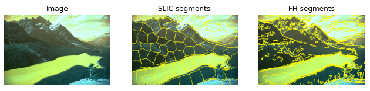

# Comparative study of the superpixel segmentation algorithm SLIC and Felzenszwalb.

## Introduction

A segmentation in superpixels consists in dividing an image into groupings of pixels, called super-pixels. These superpixels should be close enough in size and shape, stick to the object's borders, or still have consistent colors.Superpixel segmentation is generally used as an image preprocessing step for computer vision, such as pattern recognition or even visual monitoring . Working on a pixel cluster rather than pixels has many advantages. On the one hand, by simplifying the representation of an image, it makes it possible to reduce the calculation time associated with the processing of these images. Another advantage is that superpixels allow an image to be observed at a larger scale, which provides better spatial information for measuring regional characteristics.

To create these superpixels, many algorithms have emerged in the literature (SEEDS, GMM, ERS, NCut, ...). These methods can be separated into two main classes : methods based on graphs and methods based on gradient. In order to have a global vision of superpixel segmentation, this thesis presents a gradient algorithm, the SLIC, then the superpixel segmentation algorithm of Felzenszwalb and Huttenlocher based on graph methods. These are two algorithms which have for objective the partitioning of the data but which will do it in a very different way, we can already see this difference in the form that the superpixels take in this figure.

To be able to understand what are the advantages and the drawbacks of superpixel segmentation algorithms, it is important to study the properties of these algorithms. This report therefore also aims to propose a complete methodology for evaluating the performance of a superpixel segmentation algorithm. A comparative study will then be carried out on the two algorithms studied during this internship. It will make it possible to identify the strengths of this algorithms and the drawbacks. Although this methodology is performed on two superpixel segmentation algorithms, there are many others. This type of study is therefore part of the growing need to understand the benefits of each of these methods.

## The properties that superpixels must respect

The goal of a superpixel segmentation method is to split an image into groupings of pixels, called superpixels. They should be fairly close in size and shape, but also stick to the object's borders, or even have consistent colors. This difference in the size of the superpixels makes it possible to distinguish this method from the methods of segmentation of shapes. In the litterature, their characteristics are well known, they are summarized below : 

* **The precision** : is the characteristic of the superpixel to stick to the borders of objects in an image. Failure to respect this property can have serious consequences on the post-processing steps, such as for pattern recognition.
* **Regularity of shapes** :  of a superpixel allows for better image analysis, and therefore for better performance on pattern recognition applications.
* **Color homogeneity** : superpixel requires the intensity variation to be as low as possible. In other words, the pixels within the same superpixel must be very similar in terms of color intensity.
* **Computational efficiency** : for implementation on real issues.

## Implementation of metrics in python to evaluate these properties
All mathematical formulas can be found in this paper: https://hal.archives-ouvertes.fr/hal-01519635/file/Giraud_JEI_GR.pdf

* **The explained variation (EV)** : Allows you to measure the color homogeneity of a superpixel.
* **Undersegmentation Error (UE)** :  To calculate the proximity level of superpixels to image borders.  
* **Regularity of shapes (SRC)** : Used to measure the compactness of superpixels. This metric will perform well for square shapes, circles or hexagons, so we try to maximize this criterion.
* **Regularity of shapes (C)** : Allows you to measure the compactness of a superpixel, individually.

#### All these metrics are available in the metrics.py file and an example of their use is given in the Tutorial.ipynb notebook
  

    
